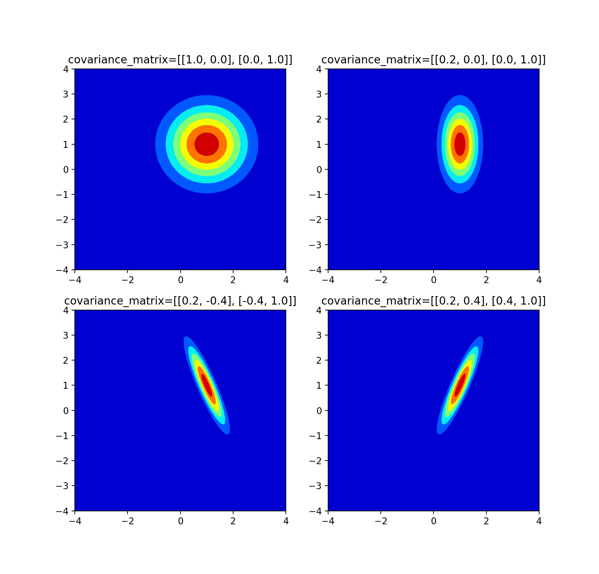

Multivariate gaussian model

$$f_\boldsymbol{x}(x_1, x_2,..., x_n) \propto \mathrm{exp}(-\frac{1}{2}(\boldsymbol{x}-\boldsymbol{\mu})^\mathrm{T}\boldsymbol{\Sigma}^{-1}(\boldsymbol{x}-\boldsymbol{\mu})),$$

and the normalization factor is given by $$\frac{1}{\sqrt{(2 \pi)^k} \mathrm{det}(\boldsymbol{\Sigma})}.$$


```python
#plot Multivariate gaussian 
#using tensor contraction (imn)(ij)(jmn)->mn, which gives 'i...,ij,j...'
#i (= j) is the # of variates, (m,n) is the # of grid points, 
#where the probability density function is calculated

import numpy as np
import matplotlib.pyplot as plt

x = np.linspace(-4,4,200)
x1, x2 = np.meshgrid(x, x)
covar = np.array([[[1,0], [0, 1]],[[0.2,0], [0, 1]],[[0.2,-0.4], [-0.4, 1]],[[0.2,.4], [.4, 1]]])
mu_vec = np.array([1,1])
shifted_mu_vec = np.array([x1-mu_vec[0],x2-mu_vec[1]])
for i in range(4):
    tensor_contraction=np.einsum('i...,ij,j...', shifted_mu_vec, np.linalg.inv(covar[i]), shifted_mu_vec)
    density_matrix = np.exp(-0.5*tensor_contraction)
    plt.subplot(2,2, i+1)
    plt.contourf(x1, x2, density_matrix, cmap = 'jet')   
    plt.title('covariance_matrix=%s' % covar[i].tolist())
plt.show()


```
